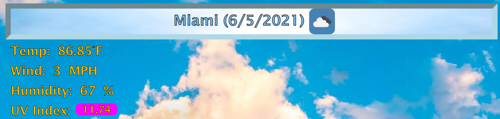

# Weather Dashboard

## **The Weather Dashboard**
This program allows you to see the weather in a city chosen by the user. It will show the user a visual representation of the current weather as the background and an icon next to the date, as well as the five day forcast. It will save the search history of the user's input with the oldest at the top and the newest at the bottom. 

- The user is presented with a simple header, stating the purpose of the webpage.

- On the left side, we are presented with the search bar, search button and a list of buttons for the users to select. 

- On initial page load, if there exist any previously searched city in the local storage, the last searched city will appear on page refresh or initial load. The background is based on the citie's current weather icon.

- By default, the background is set to neutral but a dynamic background toggle is there for the user. 

- If there is no search history, a light blue background appears and the search button and user input bar are visible on the left. 

- Lets check out the weather in Miami today. We can see the current temperature, wind speed, humidity and UV index. 

- It also displays the 5 day forcast as well as well as a dynamic background based on the icon of the forecasted weather which can also be removed with the toggle. 

- The UV index box also  changes dynamically based on the levels. The levels and colors have been determined by the EPA, [Guide to UV Index Guide](https://www.epa.gov/sites/production/files/documents/uviguide.pdf)

- It also accounts for night weather, but only for the current weather, due the limitations of the openweathermap API. 

- For mobile users, the viewing experience is condensed but usable, even on the narrowest of phones 

- Creating and populating the buttons without using hardcoded elements in the HTML allows us to easily add and remove elements and  structure the HTML elements as we please, without worrying about stepping over harded coded elements. This allows for greater expandability of the program in the future. 

# Why it Matters?
The weather app, specifically the oneweathermap API makes it easy to use data and populate our elements to provide users with a great experience, while cutting down on the developers data mining. Using data already available, developers can easily create dynamic programs that are always up to date, so long as the API is in use and updated as needed. The features of openweathermap allows us to expand the application in the future to display the 5 day forecast hour by hour, and given the code structure, a simple div on each card element could be populated and act as a drop down to a series of cards that provide users with the weather at certain hours of the day (5 day/3 hour API).

Visit my Weather Dashboard [by clicking here](https://brobro10000.github.io/weather-dashboard) or follow the direct link at [https://brobro10000.github.io/weather-dashboard](https://brobro10000.github.io/weather-dashboard). 

## 
We Hope to see you there!
 ##
